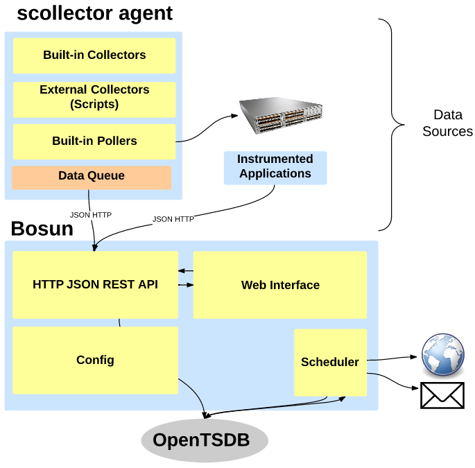



* auto-gen TOC:
{:toc}

#Architecture

The main components are:

* **scollector**: An agent that provides data collection
	* A binary that gathers Linux and Windows data locally from the system (no external libraries needed)
	* Has built-in collectors
	* Can data poll network devices via SNMP and VSphere
	* Can run external scripts
	* Queues data when Bosun can't be reached
	* Sends data to bosun via compressed JSON to a REST API
* **bosun**: Data collection and relaying, alerting, and graphing
	* Has an expression language for creating alerts from time-series data queried from OpenTSDB
	* Exposes the Go template language for users to craft alert notifications
	* Has notification escalation
	* Relays data to OpenTSDB
	* Collects Metadata (String information about things like hosts (i.e. IP Address, Serial Numbers)) and information about metrics: Description, Gauge vs Counter, and the metrics's measurement unit. Currently stored locally on the server as a state file
	* Text Configuration that can be version controlled: support macros, lookup tables, alert configuration, notifications, and notification templates
	* Web Interface:
		* Has an alert dashboard: Currently Triggered Alerts, Acknowledgments etc. Can also view alert history
		* Has a Graphing interface
		* Has a page for running expressions
		* Has a page for silencing alerts
		* Has a page for testing alerts over history and previewing notifications
		* Host views for basic host information such as CPU, Memory, Network throughput, and Disk Space
		* Page to validate configuration

## Diagram

# Alerts

Each alert definition has the potential to turn into multiple alert instances ("alerts"). Alerts are uniquely identified by the alert name and the OpenTSDB tagset (which we also call the group). Every possible group in your top level expression is evaluated independently. As an example, with an expression like `avg(q("avg:rate{counter,,1}:os.cpu{host=*}", "5m", ""))` you can get an alert for every tag-value of the "host" tag-key that has sent data for the os.cpu metric. In this way bosun integrates fairly tightly with OpenTSDB, however there are ways to change alert groups in expressions (in particular, by using the t() (transpose) function).

## Severity States

Alerts can be in one of the following severity levels (From Highest to Lowest):

* **Unknown**: When a warn or crit expression can not be evaluated because data is missing. When you define an alert bosun tracks each instance (aka group) for each expression used in the expression. If one of these is no longer present, that instance goes into an unknown state. Since bosun has data pushed to it, unknown can mean that either data collection has failed, or that the source is down. Unknown triggers when there is no data in a query + the check frequency. This means that if a query spans an hour, it will be one hour + the check frequency before it triggers.
* **Error**: There is some sort of bosun internal error such as divide by zero or "response too large" with the alert.
* **Critical**: The expression that `crit` is equal to in the alert definition is non-zero (true). It is recommend that "Critical" be thought of as "has failed".
* **Warning**: The expression that `warn` is equal to in the alert definition is non-zero (true) *and* critical is not true. It is recommended that warning be thought of ha "could lead to failure".
* **Normal**: No problems.

## Additional States

* **Active**: The alert is currently in the severity state that triggered it. This is indicated by an exclamation on the dashboard: .
* **Silenced**: Someone has created a silence rule that stops this alert from triggering any notification. It will also automatically close when the alert is no longer active. This is indicated by a speaker with an X icon on the dashboard: .
* **Acknowledged**: Someone has acknowledged the alert, the reason and person should be available via the web interface. Acknowledged alerts stop sending notifications as long as the severity doesn't increase.
* **Unacknowledged**: Nobody has acknowledged the alert yet at its current severity level.

# Dashboard

## Indicators

### Colors

* **Blue**: The alert was/is unknown when triggered
* **Red**: The alert was/is critical or error when triggered
* **Yellow**: The alert was/is warning when triggered

### Icons

*  An Exclamation means the alert is currently triggered (active). Alerts don't disappear from the dashboard when they are no longer active until they are closed. This is to ensure that all alerts get handled - which reduces alert noise and fatigue.
*  A silence icon means the alert has been silenced. Silenced alerts don't send notifications, and automatically close when no longer active.

## Actions

* **Acknowledge**: Prevent further notifications unless there is a state increase. This also moves it to the acknowledged section of the dashboard. When you acknowledge something you enter a name and a reason. So this means that the person has committed to fixing the problem or the alert.
* **Close**: Make it disappear from the dashboard. This should be used when an alert is handled. Active alerts can not be closed (since all that will happen is that will reappear on the the dashboard after the next schedule run).
* **Forget**: Make bosun forget about this instance of the alert. This is used on active unknown alerts. It is useful when something is not coming back (i.e. you have decommissioned a host). This act is non-destructive because if that data gets sent to bosun again everything will come back.
* **History**: View a timeline of history for the selected alert instances.

# Test Config

The test configuration page shows the configuration that bosun started with. You can edit or paste a changed config to make sure there are no syntax errors before committing it and restarting bosun. Currently you have to handle your own configuration management, but in the future we may attempt to integrate this with git.


