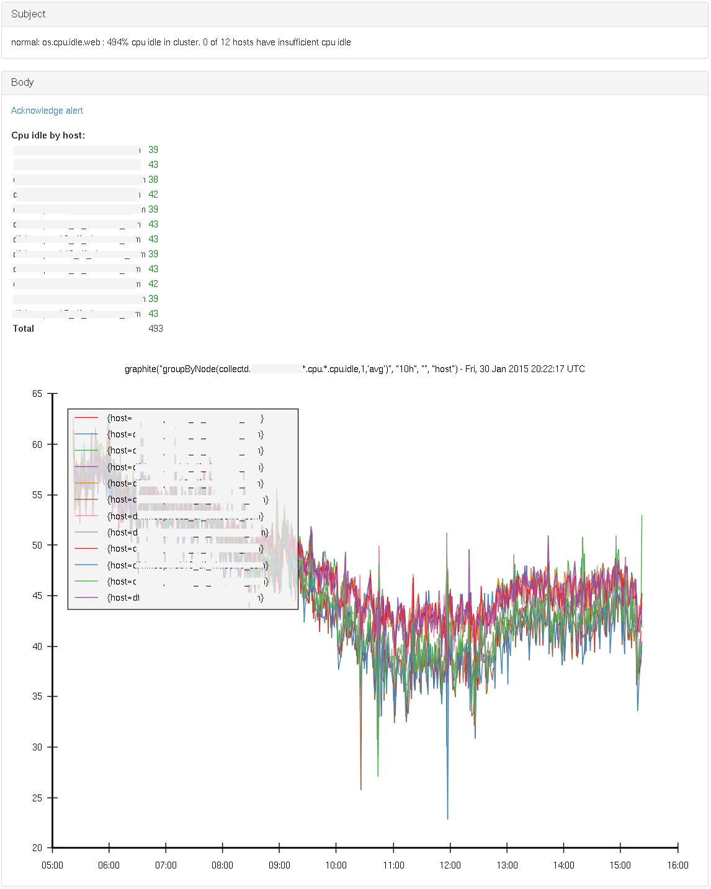
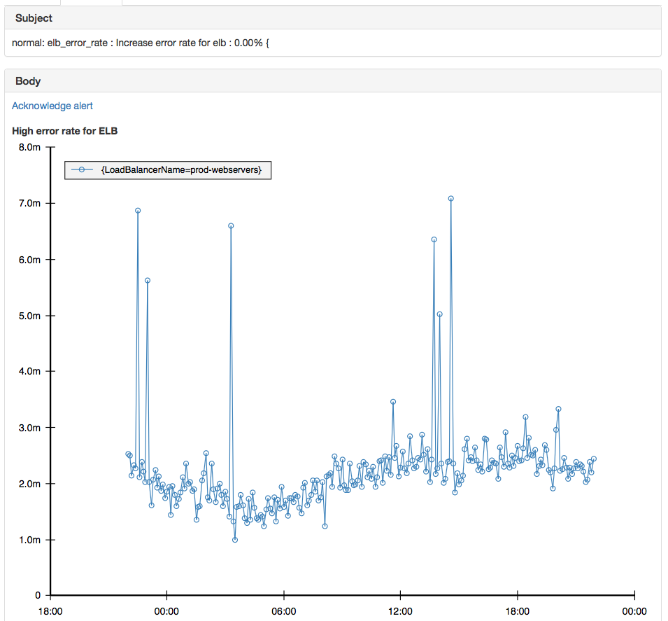
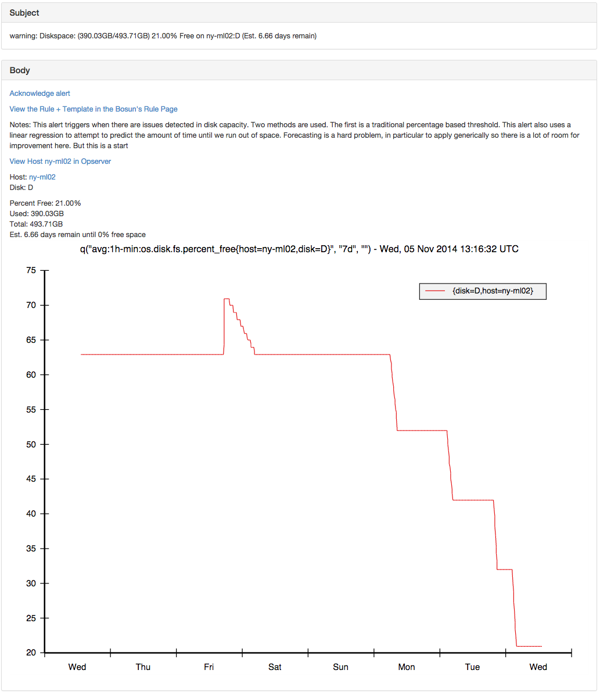
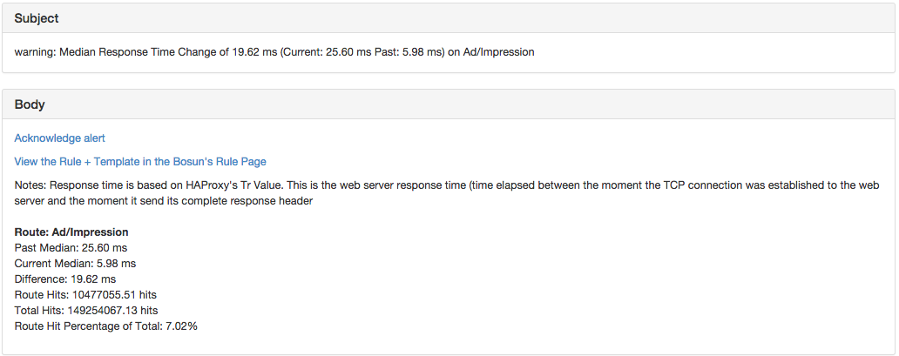
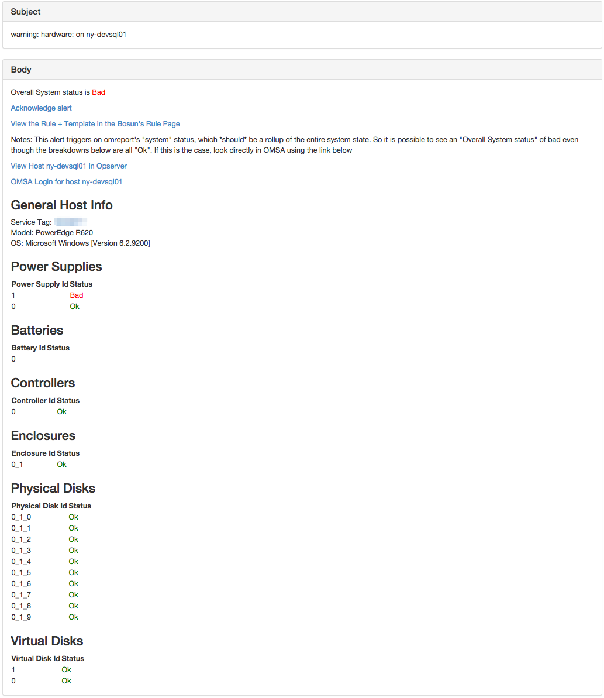
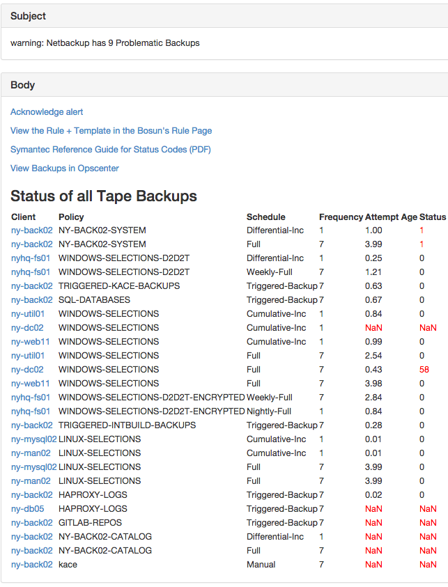

  

 
 * Some TOC
 {:toc}
 
  



Examples

## Basic Alerts

### Combine metrics

Rule

In this alert we use the slim (session limit) metric and compare it to the current amount of sessions on each frontend. Because of this ability to combine metrics, we can easily create a percentage of utilization even though that metric doesn't exist in haproxy's csv stats.

~~~
alert haproxy_session_limit {
    macro = host_based
    template = generic
    $notes = This alert monitors the percentage of sessions against the session limit in haproxy (maxconn) and alerts when we are getting close to that limit and will need to raise that limit. This alert was created due to a socket outage we experienced for that reason
    $current_sessions = max(q("sum:haproxy.frontend.scur{host=*,pxname=*,tier=*}", "5m", ""))
    $session_limit = max(q("sum:haproxy.frontend.slim{host=*,pxname=*,tier=*}", "5m", ""))
    $q = ($current_sessions / $session_limit) * 100
    warn = $q > 80
    crit = $q > 95
}
~~~

### *Consistently* in a certain state
Some metrics represent bools, (0 for false, 1 for true). If we take a time series and run min on that, we know that has been in a false state for the entire duration. So the following lets us know if puppet has been left disabled for more than 24 hours:

Rule
 

~~~
alert puppet.left.disabled {
    macro = host_based
    template = generic
    $notes = More often than not, if puppet has been consistently disabled for more than 24 hours some forgot to re-enable it
    $oquery = "avg:24h-min:puppet.disabled{host=*}"
    $q = min(q($oquery, "24h", ""))
    warn = $q > 0
}
~~~

### Macro that establishes contacts based on host name
This is an example of one of our basic alerts at Stack Exchange. We have an IT and SRE team, so for host based alerts we make it so that the appropriate team is alerted for those hosts using our macro and lookup functionality. Macros reduce reuse for alert definitions. The lookup table is like a case statement that lets you change values based on the instance of the alert. The generic template is meant for when warn and crit use basically the same expression with different thresholds.  Templates can include other templates, so we make reusable components that we may want to include in other alerts.

Rule

~~~
lookup host_base_contact {
    entry host=nyhq-|-int|den-*|lon-* {
        main_contact = it
        chat_contact = it-chat
    }
    entry host=* {
        main_contact = default
    }
}

macro host_based {
    warnNotification = lookup("host_base_contact", "main_contact")
    critNotification = lookup("host_base_contact", "main_contact")
    warnNotification = lookup("host_base_contact", "chat_contact")
    critNotification = lookup("host_base_contact", "chat_contact")
}

alert os.low.memory {
    macro = host_based
    template = generic
    $notes = In Linux, Buffers and Cache are considered "Free Memory"
    #Unit string shows up in the subject of the "Generic" template
    $unit_string = % Free Memory
    $q = avg(q("avg:os.mem.percent_free{host=*}", $default_time, ""))
    crit = $q <= .5
    warn = $q < 5
    squelch = host=sql|devsearch
}
~~~

Template

~~~

template generic {
    body = `{{template "header" .}}
    {{template "def" .}}
    
    {{template "tags" .}}

    {{template "computation" .}}`
    subject = {{.Last.Status}}: {{replace .Alert.Name "." " " -1}}: {{.Eval .Alert.Vars.q | printf "%.2f"}}{{if .Alert.Vars.unit_string}}{{.Alert.Vars.unit_string}}{{end}} on {{.Group.host}}
}

template def {
    body = `
<strong>Alert definition:</strong>
    <table>
        <tr>
            <td>Name:</td>
            <td>{{replace .Alert.Name "." " " -1}}</td></tr>
        <tr>
            <td>Warn:</td>
            <td>{{.Alert.Warn}}</td></tr>
        <tr>
            <td>Crit:</td>
            <td>{{.Alert.Crit}}</td></tr>
    </table>`
}

template tags {
    body = `
<strong>Tags</strong>
    
    <table>
        {{range $k, $v := .Group}}
            {{if eq $k "host"}}
                <tr><td>{{$k}}</td><td><a href="{{$.HostView $v}}">{{$v}}</a></td></tr>
            {{else}}
                <tr><td>{{$k}}</td><td>{{$v}}</td></tr>
            {{end}}
        {{end}}
    </table>`
}

template computation {
    body = `
    
<strong>Computation</strong>
    
    <table>
        {{range .Computations}}
            <tr><td><a href="{{$.Expr .Text}}">{{.Text}}</a></td><td>{{.Value}}</td></tr>
        {{end}}
    </table>`
}

template header {
    body = `
<a href="{{.Ack}}">Acknowledge alert</a>
    
<a href="{{.Rule}}">View the Rule + Template in the Bosun's Rule Page</a>
    {{if .Alert.Vars.notes}}
    
Notes: {{.Alert.Vars.notes}}
    {{end}}
    {{if .Group.host}}
    
<a href="https://status.stackexchange.com/dashboard/node?node={{.Group.host}}">View Host {{.Group.host}} in Opserver</a>
    {{end}}
    `
}

~~~

### Graphite: Verify available cluster cpu capacity.

This rule checks the current cpu capacity (avg per core, for the last 5 minutes), for each host in a cluster.

We warn if more than 80% of systems have less than 20% capacity available, or if there's less than 200% in total in the cluster, irrespective of how many hosts there are and where the spare capacity is. Critical is for 90% and 50% respectively.

By checking a value that scales along with the size of the cluster, and one that puts an absolute lower limit, we can cover more ground.  But this is of course specific to the context of the environment and usage patterns.  Note that via groupByNode() the timeseries as returned by Graphite only have the hostname in them.

To provide a bit more context to the operator, we also plot the last 10 hours on a graph in the alert

Rule

~~~
alert os.cpu.idle.web {
    template = os_cpu_idle_web
    $expr = "groupByNode(collectd.dc1-web*.cpu.*.cpu.idle,1,'avg')"
    $idle_series_by_host = graphite($expr, "5m", "", "host")
    $idle_series_by_host_historical = graphite($expr, "10h", "", "host")
    $idle_by_host = avg($idle_series_by_host)
    $num_hosts = len(t($idle_by_host, ""))
    $idle_total= sum(t($idle_by_host, ""))

    $hosts_low = t($idle_by_host < 20, "")
    $num_hosts_low = sum($hosts_low)
    $ratio_hosts_low = ($num_hosts_low / $num_hosts)

    warn = ($ratio_hosts_low > 0.8) || ($idle_total < 200)
    crit = ($ratio_hosts_low > 0.9) || ($idle_total < 50)
}
~~~

Template

~~~
template os_cpu_idle_web {
    body = `<a href="{{.Ack}}">Acknowledge alert</a>
     
     
    <b>Cpu idle by host:</b>
    <table>
    {{range $f := .EvalAll .Alert.Vars.idle_by_host}}
        <tr><td>{{ $f.Group.host}}</td>
        {{if lt $f.Value 20.0}}
            <td style="color: red;">
            {{else}}
                <td style="color: green;">
            {{end}}
        {{ $f.Value | printf "%.0f" }}</td></tr>
    {{end}}
    <tr><td><b>Total</b></td><td>{{.Eval .Alert.Vars.idle_total | printf "%.0f" }}</td></tr>
    </table>
     
    {{.Graph .Alert.Vars.idle_series_by_host_historical}}
`
    subject = {{.Last.Status}}: {{.Alert.Name}} : {{.Eval .Alert.Vars.idle_total | printf "%.0f"}}% cpu idle in cluster. {{.Eval .Alert.Vars.num_hosts_low}} of {{.Eval .Alert.Vars.num_hosts}} hosts have insufficient cpu idle
}
~~~

### Cloudwatch: Percentage error rate for an elb.

This rule checks the percentage error rate for all requests through an elastic load balancer.

We warn if more than 0.1% of requests returned a 5xx status code and send a critical notification if the error rate exceeds 1%.

Using the ratio of errors to total requests allows us to have a much lower threshold without false positives than simply trying
to alert on the count of errors because it compensates for daily traffic level variations.

Rule

~~~
alert elb_error_rate {
    critNotification = default
    template = elb_error_rate
    $region="eu-west-1"
    $namespace="AWS/ELB"
    $period="60"
    $statistics="Sum"
    $dimensions="LoadBalancerName:prod-webservers"

    $requests = cw($region, $namespace, "RequestCount", $period, $statistics, $dimensions, "15m", "")
    $500s = cw($region, $namespace, "HTTPCode_Backend_5XX", $period, $statistics, $dimensions, "15m", "")
    $percentage = ( $500s/$requests * 100 )

    #Calculate the historic error rate to put in the notification graph
    $hPeriod = "360"
    $hRequests = cw($region, $namespace, "RequestCount", $hPeriod, $statistics, $dimensions, "24h", "")
    $h500s=cw($region, $namespace, "HTTPCode_Backend_5XX", $hPeriod, $statistics, $dimensions, "24h", "")
    $hPercentage = ( $h500s/$hRequests * 100 )

    $avg=avg($percentage)
    warn = $avg > 0.1
    crit = $avg > 1
}
~~~

Template

~~~

template elb_error_rate {
    body = `<a href="{{.Ack}}">Acknowledge alert</a>
     
     
    <b>High error rate for ELB</b>

     
    {{.Graph .Alert.Vars.hPercentage | printf "%.2f"}}
    `
    subject = {{.Last.Status}}: {{.Alert.Name}} : Increase error rate for elb : {{.Eval .Alert.Vars.avg | printf "%.2f"}}% 
}
~~~

## Forecasting Alerts

### Forecast Disk space
This alert mixes thresholds and forecasting to trigger alerts based on disk space. This can be very useful because it can warn about a situation that will result in the loss of diskspace before it is too late to go and fix the issue. This is combined with a threshold based alert because a good general rule is to try to eliminate duplicate notifications / alerts on the same object. So these are applied and tuned by the operator and are not auto-magic.

Once we have string support for lookup tables, the duration that the forecast acts on can be tuned per host when relevant (some disks will have longer or shorter periodicity).

The forecastlr function returns the number of seconds until the specified value will be reached according to a linear regression. It is a pretty naive way of forecasting, but has been effective. Also, there is no reason we can't extend bosun to include more advanced forecasting functions.

Rule

~~~
lookup disk_space {
    entry host=ny-omni01,disk=E {
        warn_percent_free = 2
        crit_percent_free = 0
    }
    entry host=*,disk=* {
        warn_percent_free = 10
        crit_percent_free = 0
    }
}

alert os.diskspace {
    macro = host_based
    $notes = This alert triggers when there are issues detected in disk capacity. Two methods are used. The first is a traditional percentage based threshold. This alert also uses a linear regression to attempt to predict the amount of time until we run out of space. Forecasting is a hard problem, in particular to apply generically so there is a lot of room for improvement here. But this is a start
    template = diskspace
    $filter = host=*,disk=*
    
    ##Forecast Section
    #Downsampling avg on opentsdb side will save the linear regression a lot of work
    $days_to_zero = (forecastlr(q("avg:6h-avg:os.disk.fs.percent_free{$filter}", "7d", ""), 0) / 60 / 60 / 24)
    #Threshold can be higher here once we support string lookups in lookup tables https://github.com/bosun-monitor/bosun/issues/268
    $warn_days = $days_to_zero > 0 && $days_to_zero < 7
    $crit_days =   $days_to_zero > 0 && $days_to_zero < 1
    
    ##Percent Free Section
    $pf_time = "5m"
    $percent_free = avg(q("avg:os.disk.fs.percent_free{host=*,disk=*}", $pf_time, ""))
    $used = avg(q("avg:os.disk.fs.space_used{host=*,disk=*}", $pf_time, ""))
    $total = avg(q("avg:os.disk.fs.space_total{host=*,disk=*}", $pf_time, ""))
    $warn_percent = $percent_free <  lookup("disk_space", "warn_percent_free")
    #Linux stops root from writing at less than 5%
    $crit_percent = $percent_free <  lookup("disk_space", "crit_percent_free")
    #For graph (long time)
    $percent_free_graph = q("avg:1h-min:os.disk.fs.percent_free{host=*,disk=*}", "4d", "")
    
    ##Main Logic
    warn = $warn_percent || $warn_days
    crit = $crit_percent || $crit_days
    
    ##Options
    squelch = $disk_squelch
    ignoreUnknown = true
    #This is needed because disks go away when the forecast doesn't
    unjoinedOk = true
    
}
~~~

Template

~~~
template diskspace {
    body = `{{template "header" .}}
    
Host: <a href="{{.HostView .Group.host | short }}">{{.Group.host}}</a>
     Disk: {{.Group.disk}}

    
Percent Free: {{.Eval .Alert.Vars.percent_free | printf "%.2f"}}%
     Used: {{.Eval .Alert.Vars.used | bytes}}
     Total: {{.Eval .Alert.Vars.total | bytes}}
     Est. {{.Eval .Alert.Vars.days_to_zero | printf "%.2f"}} days remain until 0% free space
    {{/* .Graph .Alert.Vars.percent_free_graph */}}
    {{printf "q(\"avg:1h-min:os.disk.fs.percent_free{host=%s,disk=%s}\", \"7d\", \"\")" .Group.host .Group.disk | .Graph}}
    `
    subject = {{.Last.Status}}: Diskspace: ({{.Alert.Vars.used | .Eval | bytes}}/{{.Alert.Vars.total | .Eval | bytes}}) {{.Alert.Vars.percent_free | .Eval | printf "%.2f"}}% Free on {{.Group.host}}:{{.Group.disk}} (Est. {{.Eval .Alert.Vars.days_to_zero | printf "%.2f"}} days remain)
}
~~~

## Anomalous Alerts
The idea of an anomalous alert it in Bosun is that a deviation from the norm can be detected without having to set static thresholds for everything. These can be very useful when the amount of data makes it unfeasible to manually set thresholds for these. Attempts to fully automate this from what I have seen and been told are noisy. So Bosun doesn't just have an "anomalous" function, but rather you can query history and do various comparisons with that data.

### Anomalous response per route
At Stack Exchange we send which web route was hit to haproxy so that gets logged (It is removed before sent to the client). With over a thousand routes, static thresholds are not feasible. So this looks at history using the band function, and compares it to current performance. An alert is then triggered if the route makes up more than 1% of our total hits, and has gotten slower or faster by more than 10 milliseconds.

Rule

~~~
alert slower.route.performance {
    template = route.performance
    $notes = Response time is based on HAProxy's Tr Value. This is the web server response time (time elapsed between the moment the TCP connection was established to the web server and the moment it send its complete response header
    $duration = "1d"
    $route=*
    $metric = "sum:10m-avg:haproxy.logs.route_tr_median{route=$route}"
    $route_hit_metric = "sum:10m-avg:rate{counter,,1}:haproxy.logs.hits_by_route{route=$route}"
    $total_hit_metric = "sum:10m-avg:rate{counter,,1}:haproxy.logs.hits_by_route"
    $route_hits = change($route_hit_metric, $duration, "")
    $total_hits = change($total_hit_metric, $duration, "")
    $hit_percent = $route_hits / $total_hits * 100
    $current_hitcount =  len(q($metric, $duration, ""))
    $period = "7d"
    $lookback = 4
    $history = band($metric, $duration, $period, $lookback)
    $past_dev = dev($history)
    $past_median = percentile($history, .5)
    $current_median = percentile(q($metric, $duration, ""), .5)
    $diff = $current_median - $past_median
    warn = $current_median > ($past_median + $past_dev*2) && abs($diff) > 10 && $hit_percent > 1
    warnNotification = default
    ignoreUnknown = true
}
~~~

Template

~~~
template route.performance {
    body = `{{template "header" .}}
     
     Route: {{.Group.route}}
     Past Median: {{.Eval .Alert.Vars.current_median | printf "%.2f ms"}}
     Current Median: {{.Eval .Alert.Vars.past_median | printf "%.2f ms"}}
     Difference: {{.Eval .Alert.Vars.diff | printf "%.2f ms"}}
     Route Hits: {{.Eval .Alert.Vars.route_hits | printf "%.2f hits"}}
     Total Hits: {{.Eval .Alert.Vars.total_hits | printf "%.2f hits "}}
     Route Hit Percentage of Total: {{.Eval .Alert.Vars.hit_percent | printf "%.2f"}}%
`
    subject = {{.Last.Status}}: Median Response Time Change of  {{.Eval .Alert.Vars.diff | printf "%.2f ms"}} (Current: {{.Eval .Alert.Vars.current_median | printf "%.2f ms"}} Past: {{.Eval .Alert.Vars.past_median | printf "%.2f ms"}}) on {{.Group.route}}
}
~~~

### Graphite: Anomalous traffic volume per country
At Vimeo, we use statsdaemon to track web requests/s.  Here we'll use metrics which describe the web traffic on a per server basis (we get them summed together into one series from Graphite via the sum function), and we also use a set of metrics that are already aggregated across all servers, but broken down per country.
In the alert we leverage the banding functionality to get a similar timeframe of past weeks.  We then verify that the median of the total web traffic for this period is not significantly (20% or more) less than the median of past periods.  And on the per-country basis, we verify that the current median is not 3 or more standard deviations below the past median.  Note also that we count how many countries have issues and use that to decide wether the alert is critical or warning.
Note that the screenshot below has been modified. The countries and values are not accurate.

Rule

~~~
alert requests_by_country {
    template = requests_by_country
    $r = "transformNull(sum(stats.dc1*.request.web),0)" 
    $r_hist = graphiteBand($r, "60m","7d", "",1)
    $r_now = graphite($r, "60m", "", "")
    $r_hist_med = median($r_hist)
    $r_now_med = median($r_now)

    $rbc = "aliasByNode(transformNull(stats._sum_dc1.request_by_country.*,0),3)"
    $rbc_hist = graphiteBand($rbc, "60m","7d", "country",1)
    $rbc_now = graphite($rbc, "60m", "", "country")
    $rbc_hist_med = median($rbc_hist)
    $rbc_hist_dev= dev($rbc_hist)
    $rbc_now_med = median($rbc_now)
    $rbc_now_dev = dev($rbc_now)
    
    $rbc_med_diff = ($rbc_now_med - $rbc_hist_med)/$rbc_hist_dev
    $rbc_med_bad = $rbc_med_diff < -3

    $r_strength = $r_now_med/$r_hist_med
    $rbc_med_issues = sum(t($rbc_med_bad,""))
    warn = $rbc_med_issues > 0
    crit = $rbc_med_issues > 10 || $r_strength < 0.8
    warnNotification = web
    critNotification = web
}
~~~

#### Template
~~~
template requests_by_country {
    body = `
    <a href="{{.Ack}}">Acknowledge alert</a>
     
    <h2>Web requests global</h2>
    <table>
    <tr><td>Last week</td><td>{{.Eval .Alert.Vars.r_hist_med  | printf "%.0f"}}</td></tr>
    {{if lt (.Eval .Alert.Vars.r_strength) 0.7}}
        <tr style="color:red;">
      {{else}}
        {{if lt (.Eval .Alert.Vars.r_strength) 1.0}}
                  <tr>
         {{else}}
             <tr style="color:green;">
                   {{end}}
    {{end}}
   <td> Now</td><td>{{.Eval .Alert.Vars.r_now_med | printf "%.0f"}}</td></tr>
   </table>
     <a href="http://graphexplorer/index/statsd request.web sum by n1 from -1week||">GE graph</a>
     
     
    <h2>Web requests per country</h2>
     <a href="http://graphexplorer/index/request by country _sum_dc1">GE graph</a>
     median diff lower than -3 is bad
     bad values are marked in red.
       <table style="border-spacing: 10px;">
       <tr>
           <th>Country</th>
           <th>hist (med +- dev)</th>
           <th>now (med +- dev)</th>
           <th>med diff (in devs)</th>
           </tr>
    {{range $r := .LeftJoin .Alert.Vars.rbc_hist_med .Alert.Vars.rbc_hist_dev .Alert.Vars.rbc_now_med .Alert.Vars.rbc_now_dev .Alert.Vars.rbc_med_diff .Alert.Vars.rbc_med_bad}}
        <tr>
            <td>{{(index $r 0).Group.country}}</td>
            <td> {{ (index $r 0).Value | printf "%.0f"}} +- {{ (index $r 1).Value | printf "%.0f"}}</td>
            <td> {{ (index $r 2).Value | printf "%.0f"}} +- {{ (index $r 3).Value | printf "%.0f"}}</td>
            {{ if gt (index $r 5).Value 0.0}}
                <td style="color:red;" >{{ (index $r 4).Value | printf "%.0f"}}</td>
            {{else}}
                  <td style="color:green;"> {{ (index $r 4).Value | printf "%.0f"}}</td>
             {{end}}
            <td><a href="http://graphexplorer/index/request by country _sum_dc1 n3={{(index $r 0).Group.country}}||">GE graph</a></td>
        </tr>
    {{end}}
    </table>
    `
    subject =`
    {{.Last.Status}}: {{.Alert.Name}} :
 Global traffic volume {{.Eval .Alert.Vars.r_strength | printf "%.3f"}}
 | {{.Eval .Alert.Vars.rbc_med_issues | printf "%.0f"}} Countries with dropped median:
        {{range $r :=.EvalAll .Alert.Vars.rbc_med_bad}}
        {{ if gt $r.Value 0.0}}
             {{$r.Group.country}}
         {{end}}
    {{end}}`
}
~~~

## Alerts with Notification Breakdowns
A common pattern is to trigger an alert on a scope that covers multiple metrics
(or hosts, services, etc.), but then to send more detailed information in
notification. This is useful when you notice that certain failures tend to go
together.

### Linux TCP Stack Alert
When alerting on issues with the Linux TCP stack on a host, you probably don't
want N alerts about all TCP stats, but just one alert that shows breakdowns:

Rule

~~~
# This macro isn't Show, but makes it so IT and SRE are notified for their
respective systems, when an alert is host based.

lookup linux_tcp {
	entry host=ny-tsdb03 {
		backlog_drop_threshold = 500
	}
	entry host=* {
		backlog_drop_threshold = 100
	}
}

alert linux.tcp {
	macro = host_based
	$notes = `
		This alert checks for various errors or possible issues in the
		TCP stack of a Linux host. Since these tend to happen at the
		same time, combining them into a single alert reduces
		notification noise.`
	template = linux.tcp
	$time = 10m
	$abort_failed = change("sum:rate{counter,,1}:linux.net.stat.tcp.abortfailed{host=*}", "$time", "")
	$abort_mem = change("sum:rate{counter,,1}:linux.net.stat.tcp.abortonmemory{host=*}", "$time", "")
	$ofo_pruned = change("sum:rate{counter,,1}:linux.net.stat.tcp.ofopruned{host=*}", "$time", "")
	$rcv_pruned = change("sum:rate{counter,,1}:linux.net.stat.tcp.rcvpruned{host=*}", "$time", "")
	$backlog_drop = change("sum:rate{counter,,1}:linux.net.stat.tcp.backlogdrop{host=*}", "$time", "")
	$syncookies_sent = change("sum:rate{counter,,1}:linux.net.stat.tcp.syncookiessent{host=*}", "$time", "")
	$total_err = $abort_failed + $ofo_pruned + $rcv_pruned + $backlog_drop + $syncookies_sent
	warn = $abort_failed || $ofo_pruned > 100 || $rcv_pruned > 100 || $backlog_drop > lookup("linux_tcp", "backlog_drop_threshold")  || $syncookies_sent
}
~~~

Template Def

~~~
template linux.tcp {
	body = `
		{{template "header" .}}
		<table>
			{{/* TODO: Reference what each stat means */}}
			<tr><th>Stat</th><th>Count in the last {{.Alert.Vars.time}}</th></tr>
			<tr><td>TCP Abort Failed</td><td>{{.Eval .Alert.Vars.abort_failed | printf "%.2f"}}<td></tr>
			<tr><td>Out Of Order Pruned</td><td>{{.Eval .Alert.Vars.ofo_pruned | printf "%.2f"}}<td></tr>
			<tr><td>Receive Pruned</td><td>{{.Eval .Alert.Vars.rcv_pruned | printf "%.2f"}}<td></tr>
			<tr><td>Backlog Dropped</td><td>{{.Eval .Alert.Vars.backlog_drop | printf "%.2f"}}<td></tr>
			<tr><td>Syn Cookies Sent</td><td>{{.Eval .Alert.Vars.syncookies_sent | printf "%.2f"}}<td></tr>
			<tr><td>TOTAL Of Above</td><td>{{.Eval .Alert.Vars.total_err | printf "%.2f"}}<td></tr>
		</table>`
	subject = {{.Last.Status}}: {{.Eval .Alert.Vars.total_err | printf "%.2f"}} tcp errors on {{.Group.host}}
}
~~~

### Dell Hardware Alert
No need for N Hardware alerts when hardware is bad, just send one notification with the information needed. Metadata (generally string information) can be reported to bosun, and is reported by scollector. Therefore in the notification we can include things like the model and the service tag.

Rule

~~~
alert hardware {
    macro = host_based
    template = hardware
    $time = "30m"
    $notes = This alert triggers on omreport's "system" status, which *should* be a rollup of the entire system state. So it is possible to see an "Overall System status" of bad even though the breakdowns below are all "Ok". If this is the case, look directly in OMSA using the link below
    
    #By Component
    $power = max(q("sum:hw.ps{host=*,id=*}", $time, ""))
    $battery = max(q("sum:hw.storage.battery{host=*,id=*}", $time, ""))
    $controller = max(q("sum:hw.storage.controller{host=*,id=*}", $time, ""))
    $enclosure = max(q("sum:hw.storage.enclosure{host=*,id=*}", $time, ""))
    $physical_disk = max(q("sum:hw.storage.pdisk{host=*,id=*}", $time, ""))
    $virtual_disk = max(q("sum:hw.storage.vdisk{host=*,id=*}", $time, ""))
    #I believe the system should report the status of non-zero if the anything is bad
    #(omreport system), so everything else is for notification purposes. This works out
    #because not everything has all these components
    $system = max(q("sum:hw.system{host=*,component=*}", $time, ""))
    
    #Component Summary Per Host
    $s_power= sum(t($power, "host"))
    $s_battery = sum(t($battery, "host"))
    
    warn = $system
}
~~~

Template

~~~
template hardware {
    body = `
    
Overall System status is  {{if gt .Value 0.0}} Bad
              {{else}} Ok
              {{end}}

    {{template "header" .}}
    
<a href="https://{{.Group.host}}:1311/OMSALogin?msgStatus=null">OMSA Login for host {{.Group.host}}</a>
    <h3>General Host Info</h3>
    {{ with .GetMeta "" "svctag" (printf "host=%s" .Group.host) }}
        Service Tag: <a href="http://www.dell.com/support/home/us/en/04/product-support/servicetag/{{.}}">{{.}}</a>
    {{ end }}
    
    {{ with .GetMeta "" "model" (printf "host=%s" .Group.host) }}
         Model: {{.}}
    {{ end }}
    
    {{ with .GetMeta "" "version" (printf "host=%s" .Group.host) }}
         OS: {{.}}
    {{ end }}
    
    <h3>Power Supplies</h3>
    <table>
    <tr><th>Power Supply Id</th><th>Status</th></tr>
    {{range $r := .EvalAll .Alert.Vars.power}}
        {{if eq $r.Group.host $.Group.host}}
            <tr>
              <td>{{$r.Group.id}}</td>
              {{if gt $r.Value 0.0}} <td style="color: red;">Bad</td>
              {{else}} <td style="color: green;">Ok</td>
              {{end}}
            </tr>
        {{end}}
    {{end}}
    </table>
    
    <h3>Batteries</h3>
    <table>
    <tr><th>Battery Id</th><th>Status</th></tr>
    {{range $r := .EvalAll .Alert.Vars.battery}}
        {{if eq $r.Group.host $.Group.host}}
            <tr>
              <td>{{$r.Group.id}}</td>
            </tr>
        {{end}}
    {{end}}
    </table>
    
    <h3>Controllers</h3>
    <table>
    <tr><th>Controller Id</th><th>Status</th></tr>
    {{range $r := .EvalAll .Alert.Vars.controller}}
        {{if eq $r.Group.host $.Group.host}}
            <tr>
              <td>{{$r.Group.id}}</td>
              {{if gt $r.Value 0.0}} <td style="color: red;">Bad</td>
              {{else}} <td style="color: green;">Ok</td>
              {{end}}
            </tr>
        {{end}}
    {{end}}
    </table>

    <h3>Enclosures</h3>
    <table>
    <tr><th>Enclosure Id</th><th>Status</th></tr>
    {{range $r := .EvalAll .Alert.Vars.enclosure}}
      {{if eq $r.Group.host $.Group.host}}
            <tr>
              <td>{{$r.Group.id}}</td>
              {{if gt $r.Value 0.0}} <td style="color: red;">Bad</td>
              {{else}} <td style="color: green;">Ok</td>
              {{end}}
            </tr>
        {{end}}
    {{end}}
    </table>

    <h3>Physical Disks</h3>
    <table>
    <tr><th>Physical Disk Id</th><th>Status</th></tr>
    {{range $r := .EvalAll .Alert.Vars.physical_disk}}
      {{if eq $r.Group.host $.Group.host}}
            <tr>
              <td>{{$r.Group.id}}</td>
              {{if gt $r.Value 0.0}} <td style="color: red;">Bad</td>
              {{else}} <td style="color: green;">Ok</td>
              {{end}}
            </tr>
        {{end}}
    {{end}}
    </table>

    <h3>Virtual Disks</h3>
    <table>
    <tr><th>Virtual Disk Id</th><th>Status</th></tr>
    {{range $r := .EvalAll .Alert.Vars.virtual_disk}}
      {{if eq $r.Group.host $.Group.host}}
            <tr>
              <td>{{$r.Group.id}}</td>
              {{if gt $r.Value 0.0}} <td style="color: red;">Bad</td>
              {{else}} <td style="color: green;">Ok</td>
              {{end}}
            </tr>
        {{end}}
    {{end}}
    </table>
    `
    subject = {{.Last.Status}}: {{replace .Alert.Name "." " " -1}}: on {{.Group.host}}
}
~~~

### Backup -- Advanced Grouping

This shows the state of backups based on multiple conditions and multiple metrics. It also simulates a Left Join operation by substituting NaN Values with numbers and the nv functions in the rule, and using the LeftJoin template function. This stretches Bosun when it comes to grouping. Generally you might want to capture this sort of logic in your collector when going to these extremes, but this displays that you don't have to be limited to that:

Rule

~~~
alert netbackup {
	template = netbackup
	$tagset = {class=*,client=*,schedule=*}
	#Turn seconds into days
	$attempt_age = max(q("sum:netbackup.backup.attempt_age$tagset", "10m", "")) / 60 / 60 / 24
	$job_frequency = max(q("sum:netbackup.backup.frequency$tagset", "10m", "")) / 60 / 60 / 24
	$job_status = max(q("sum:netbackup.backup.status$tagset", "10m", ""))
	#Add 1/4 a day to the frequency as some buffer
	$not_run_in_time = nv($attempt_age, 1e9) > nv($job_frequency+.25, 1)
	$problems = $not_run_in_time || nv($job_status, 1)
	$summary = sum(t($problems, ""))
	warn = $summary
}
~~~

Temp
late Def

~~~
template netbackup {
	subject = `{{.Last.Status}}: Netbackup has {{.Eval .Alert.Vars.summary}} Problematic Backups`
	body = `
	        {{template "header" .}}
	        
<a href="http://www.symantec.com/business/support/index?page=content&id=DOC5181">Symantec Reference Guide for Status Codes (PDF)</a>
	        
<a href="https://ny-back02.ds.stackexchange.com/opscenter/">View Backups in Opscenter</a>
	        <h3>Status of all Tape Backups</h3>
		<table>
		<tr><th>Client</th><th>Policy</th><th>Schedule</th><th>Frequency</th><th>Attempt Age</th><th>Status</th></tr>
	{{ range $v := .LeftJoin .Alert.Vars.job_frequency .Alert.Vars.attempt_age .Alert.Vars.job_status}}
		{{ $freq := index $v 0 }}
		{{ $age := index $v 1 }}
		{{ $status := index $v 2 }}
		<tr>
			<td><a href="https://status.stackexchange.com/dashboard/node?node={{$freq.Group.client| short}}">{{$freq.Group.client| short}}</td>
			<td>{{$freq.Group.class}}</td>
			<td>{{$freq.Group.schedule}}</td>
			<td>{{$freq.Value}}</td>
			<td {{if gt $age.Value $freq.Value }} style="color: red;" {{end}}>{{$age.Value | printf "%.2f"}}</td>
			<td{{if gt $status.Value 0.0}} style="color: red;" {{end}}>{{$status.Value}}</td>
		<tr>
	{{end}}
	</table>`
}

~~~

## Conditional Alerts

###Swapping notification unless there is a high exim mail queue
This alert makes it so that swapping won't trigger if there is a high exim mail queue on the host that is swapping. All operators (such as &&) perform a join, so this alert makes it so if there is no exim mailq for that host, then it is as if the mail queue were high.

Rule

~~~
alert linux.swapping {
    macro = host_based
    template = generic
    $notes = This alert does not trigger for our mail servers with the mail queue is high
    #NV makes it so that if mailq doesn't exist for the Host, the NaN that gets returned gets replaced with a 1 (True)
    $mail_q = nv(max(q("sum:exim.mailq_count{host=*}", "2h", "") > 5000), 1)
    $metric = "sum:rate{counter,,1}:linux.mem.pswp{host=*,direction=in}"
    $q = (median(q($metric, "2h", "")) > 1) && ! $mail_q
    warn = $q
    squelch = host=ny-devsearch*|ny-git01
}
~~~ 



