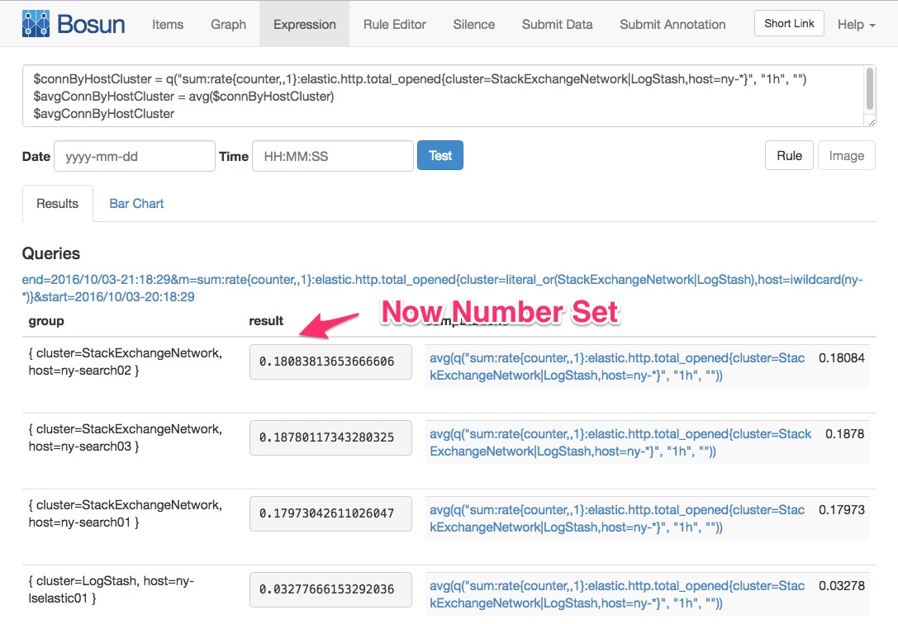

# Overview
The transpose function is one of Bosun's more powerful functions, but it also takes effort to understand. It is powerful because it lets us alert at different levels than the tag structure of the underlying data.

Transpose changes the *scope* of your alert. This lets you *scope* things into larger collections. So for example if you have queries that return a scope of `host,cluster` and want to alert based on cluster health and not individual hosts, transpose can be used to do this.

What is *scope*?  
Scope is the list of tag keys that make up your final result. For example:

 - If the scope is `host`, you get per host results in your alerts. 
 - If your scope is empty (no tag keys) then you could only possibly get one alert.
 - If your scope is `host,iface` you could get alerts for every interface on every host in the result.

So the alerts we get are tied to the tags for the data. The transpose function allows us to alert at different scopes other than the metric tag structure. So we can query things that result in `host,cluster` but alert at a `cluster` scope.

# Breaking down the function

The signature of the transpose function is:

    t(numberSet, group string) seriesSet

So it takes a *numberSet*, a *scope* a.k.a. group for the result, and returns a *seriesSet*

## What are those things?
### Set, numberSets, and seriesSets 
The results of many functions in bosun are sets, usually a *numberSet* or *seriesSet*. The entire set in the result shares the same tag *keys*. And each item in the set is unique to the value of each corresponding key. If the value of each item in the set is a series (timestamp:value,timestamp:value) then we have a *seriesSet*. If the value of each item is just a number, then we have a *numberSet*.

### The meat of it
Transpose takes a *numberSet* and returns a *seriesSet* with a larger scope (less tag keys). The resulting *seriesSet* is a bit strange because the index is not time as is the usual case of a *seriesSet*, so timevalue is no longer time and is just an index number. It should therefore be ignored.

So we end up *transposing* set items into values of the resulting set, where the resulting set type (a seriesSet) can hold multiple values:

# Lets step through an example:

    # This returns a seriesSet of a scope of host,cluster
    $connByHostCluster = q(\"sum:rate{counter,,1}:elastic.http.total_opened{cluster=StackExchangeNetwork|LogStash,host=ny-*}\", \"1h\", \"\")

    
    # Turn each item in the set into a numberSet by reducing it via average
    $avgConnByHostCluster = avg($connByHostCluster)

    
    # Transpose to new scope 
    $clusterScope = t($avgConnByHostCluster, \"cluster\")

You can now do neat things with each item that represents the cluster. For example you could do `sum($clusterScope > 5)` (Note that `$clusterScope` is a *seriesSet*) to get the count of items in the cluster where each item has a rate above five. You could then alert if the count is greater than a certain value. For example, you could also use `len($clusterScope)` to get the number of hosts in each cluster, and alert on the count of hosts above the threshold relative to the number of hosts in the cluster.

Attribution

This content was ported over from Stack Overflow Documentation, now retired. To access the source and attribution please access the <a href="https://archive.org/details/documentation-dump.7z">Docs archive</a> and reference topic ID: 7213 and example ID: 24079.

